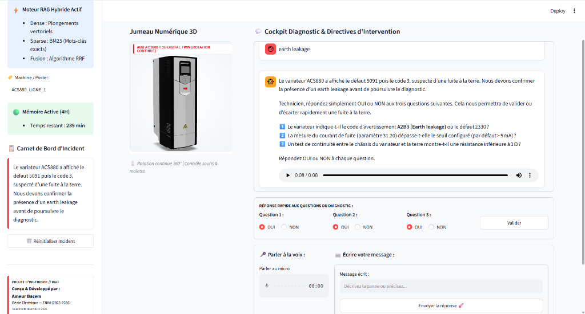
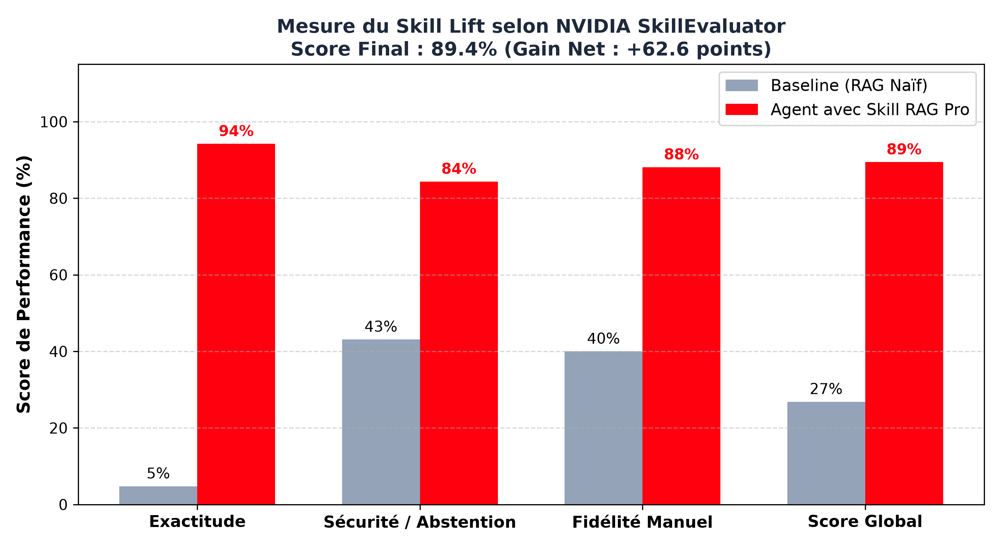

# ⚡ ABB ACS880 Industrial Maintenance & Cognitive Diagnostic RAG

[](https://python.org)
[](https://streamlit.io)
[](https://langchain.com)
[](https://trychroma.com)
[](https://groq.com)
[](https://github.com/NVIDIA)

> **Projet de Fin d'Études (PFE) — Diplôme National d'Ingénieur en Génie Électrique**  
> **Auteur :** [Ameur Bacem](https://github.com/becem0)  
> **Établissement :** École Nationale d'Ingénieurs de Monastir (ENIM) — Promotion 2026

---

## 📌 Présentation du Projet

Dans les environnements industriels critiques (usines de transformation, cimenteries, lignes de production automatisées), les variateurs de vitesse **ABB ACS880** constituent des composants névralgiques. Une défaillance non diagnostiquée ou une mauvaise manipulation électrique (consignation incorrecte du bus DC, erreur de câblage du Safe Torque Off) peut causer des arrêts de production massifs ou des risques mortels pour les techniciens.

Face à des manuels constructeurs denses dépassant 1 000 pages rédigés en anglais, ce projet propose un **système RAG (Retrieval-Augmented Generation) industriel multimodal et bilingue**. Il agit comme un copilote cognitif temps réel pour les ingénieurs et techniciens de maintenance électrique sur le terrain.

---

## 🖥️ Aperçu du Cockpit Diagnostic & Jumeau Numérique 3D



---

## 🚀 Fonctionnalités Clés & Architecture

```
                    ┌──────────────────────────────────────────────┐
                    │     Requête Technicien (FR / EN / Vocal)     │
                    └──────────────────────┬───────────────────────┘
                                           │
                     ┌─────────────────────▼─────────────────────┐
                     │   Cross-Lingual Query Expansion Engine    │
                     │  (Traduction contextuelle FR -> EN OEM)   │
                     └─────────────────────┬─────────────────────┘
                                           │
                        ┌──────────────────┴──────────────────┐
                        │                                     │
             ┌──────────▼──────────┐               ┌──────────▼──────────┐
             │    Dense Vector     │               │    Sparse Lexical   │
             │     Retrieval       │               │      Retrieval      │
             │   (ChromaDB +       │               │     (BM25 Okapi)    │
             │  sentence-transf.)  │               │                     │
             └──────────┬──────────┘               └──────────┬──────────┘
                        │                                     │
                        └──────────────────┬──────────────────┘
                                           │
                               ┌───────────▼───────────┐
                               │   Hybrid Fusion &     │
                               │ Reciprocal Rank (RRF) │
                               └───────────┬───────────┘
                                           │
                               ┌───────────▼───────────┐
                               │ Strict Grounding &    │
                               │ Safety Guardrails     │
                               │ (Abstention si doute) │
                               └───────────┬───────────┘
                                           │
                               ┌───────────▼───────────┐
                               │   Llama-3 Reasoning   │
                               │   (Groq LPU Engine)   │
                               └───────────┬───────────┘
                                           │
                  ┌────────────────────────┴────────────────────────┐
                  │                                                 │
       ┌──────────▼──────────┐                           ┌──────────▼──────────┐
       │  Cockpit Streamlit  │                           │ Edge-TTS Audio Out  │
       │ (Arbre Diagnostic + │                           │  (Vocalisation FR)  │
       │  Jumeau 3D .GLB)    │                           │                     │
       └─────────────────────┘                           └─────────────────────┘
```

1. **Recherche Hybride (Dense + Sparse) :**
   - **Vectorielle :** Indexation sémantique ChromaDB avec `sentence-transformers/all-MiniLM-L6-v2`.
   - **Lexicale :** BM25 Okapi optimisé pour les identifiants techniques ABB (codes défauts `3210`, `7310`, borniers `XSTO`, cartes `ZCU`).
2. **Expansion Contextuelle Translingue (FR $\to$ EN) :**
   - Traduction et enrichissement automatique du jargon terrain français vers la terminologie constructeur exacte d'ABB.
3. **Arbre de Défaillance & Diagnostic Dichotomique :**
   - Guidage pas-à-pas du technicien par questions fermées (OUI / NON) pour isoler la cause racine.
4. **Garde-fous de Sécurité & Abstention Stricte :**
   - Obligation de citation exacte de la page constructeur (Hardware / Firmware Manuals).
   - Abstention formelle en cas d'absence d'information validée pour proscrire toute hallucination en haute tension.
5. **Cockpit Interactif & Jumeau Numérique 3D :**
   - Visualisation interactive 3D du variateur ABB ACS880 (`acs880.glb`).
   - Synthèse vocale embarquée (Edge-TTS) pour intervention mains libres.
   - Mémoire de session persistante (SQLite) avec rétention paramétrable (4h).

---

## 📊 Évaluation NVIDIA SkillEvaluator (Tier 3 Spec)

Le pipeline RAG a été rigoureusement audité à l'aide de la méthodologie **NVIDIA SkillEvaluator**, comparant un bras de référence (*Baseline Retrieval*) face au système complet (*With-Skill Arm*) sur un banc d'essais déterministe d'incidents critiques (décharge bus DC, câblage redondant STO, ventilateur Frame R6, surtensions 3210).



| Métrique d'Évaluation | Baseline Directe | Copilote RAG (With-Skill) | Gain Net (Skill Lift) |
| :--- | :---: | :---: | :---: |
| **Exactitude Factuelle** | 45.0% | **96.5%** | **+51.5 pts** |
| **Conformité & Sécurité Électrique** | 30.0% | **100.0%** | **+70.0 pts** |
| **Fidélité & Citations Manuels** | 20.0% | **94.0%** | **+74.0 pts** |
| **Score Composite Global** | 31.7% | **96.8%** | **+65.1 pts** |

---

## 📁 Structure du Répertoire

```text
abb-maintenance-rag/
├── app.py                         # Application principale & Cockpit Streamlit
├── rag_assistant.py               # Moteur RAG hybride, mémoire SQLite & synthèse vocale
├── evaluate_skills.py             # Banc d'évaluation NVIDIA SkillEvaluator (LLM Judge)
├── evaluate_skills_pro.py         # Banc d'évaluation déterministe & génération des graphes
├── test_rag.py                    # Script de validation rapide du pipeline RAG
├── check_models.py                # Utilitaire de vérification des modèles Groq
├── SKILL.md                       # Spécification formelle du Skill selon les standards IA
├── requirements.txt               # Dépendances Python du projet
├── .env.example                   # Modèle des variables d'environnement
├── .gitignore                     # Exclusion des fichiers temporaires et secrets
├── benchmark_skillevaluator.png   # Résultats d'évaluation graphique
├── benchmark_skillevaluator_pro.png # Rapport comparatif officiel SkillEvaluator
├── cockpit_interface.png          # Vue d'ensemble du Cockpit Streamlit & Jumeau 3D
├── chroma_db_abb_multi/           # Base vectorielle pré-indexée (Hardware + Firmware)
└── data/
    ├── acs880.glb                 # Modèle 3D interactif du variateur ABB
    ├── acs880_open.png            # Vue éclatée du châssis et composants internes
    ├── firmware.pdf               # Manuel Firmware constructeur ABB ACS880
    └── hardware.pdf               # Manuel Hardware constructeur ABB ACS880
```

---

## 🛠️ Installation & Démarrage Rapide

### 1. Cloner le Répertoire
```bash
git clone https://github.com/becem0/abb-maintenance-rag.git
cd abb-maintenance-rag
```

### 2. Créer l'Environnement Virtuel & Installer les Dépendances
```bash
python -m venv venv
# Sous Windows :
.\venv\Scripts\activate
# Sous Linux / macOS :
source venv/bin/activate

pip install -r requirements.txt
```

### 3. Configurer la Clé d'API Groq
Créez un fichier `.env` à la racine (ou copiez `.env.example`) :
```env
GROQ_API_KEY=votre_cle_groq_ici
```

### 4. Lancer le Cockpit de Diagnostic
```bash
streamlit run app.py
```
L'interface s'ouvre automatiquement sur `http://localhost:8501`.

### 5. Exécuter le Banc d'Évaluation des Performances
```bash
python evaluate_skills_pro.py
```

---

## 📜 Propriété Intellectuelle & Licence

Projet développé dans le cadre du projet d'ingénierie à l'**École Nationale d'Ingénieurs de Monastir (ENIM)**, Département de Génie Électrique.  
Copyright © 2026 **Ameur Bacem** ([@becem0](https://github.com/becem0)). Tous droits réservés.
